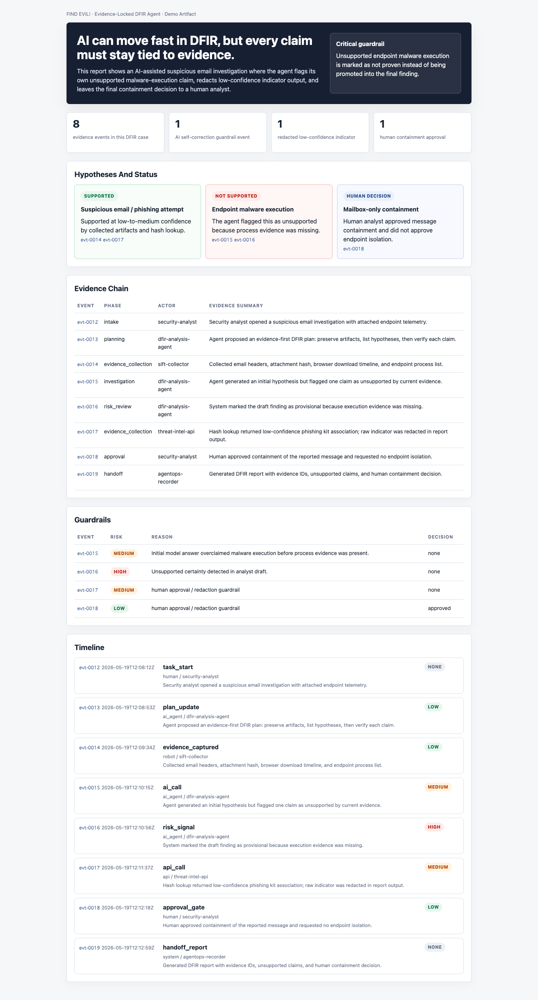

# Evidence-Locked DFIR Agent

Evidence-Locked DFIR Agent is a defensive investigation workflow for FIND EVIL.

The product idea is simple: AI can help incident responders move faster, but every claim must stay tied to evidence. Unsupported certainty is treated as a risk, not as a result.

Submission package: [SUBMISSION_PACKAGE.md](SUBMISSION_PACKAGE.md)

Live demo: https://daideguchi.github.io/evidence-locked-dfir-agent/

## Demo



Draft demo video:

```text
findevil/media/evidence-locked-dfir-agent-demo-draft.mp4
```

Open locally:

- `findevil/prototype/evidence-locked-dfir-report.html`
- `shared-agentops-engine/web/index.html`

Open in browser:

- https://daideguchi.github.io/evidence-locked-dfir-agent/

## What It Shows

- A sanitized investigation timeline
- Evidence references for each claim
- Guardrails for unsupported hypotheses
- Redaction events for sensitive values
- Human approval before containment

## Run Locally

```bash
cd shared-agentops-engine
python3 scripts/generate_portfolio_artifacts.py
python3 scripts/verify_artifacts.py
```

```bash
cd ../findevil
python3 scripts/build_dfir_case_report.py
bash scripts/build_demo_video.sh
```

Expected proof:

```text
verify_ok
status: ok
```

## Hackathon Boundary

Safe claim:

- A local evidence-locked DFIR report, case packet, self-correction event, redaction event, and human approval gate are generated.

Not claimed yet:

- Live forensic tooling.
- SIFT execution.
- Real malware attribution.

## Project Layout

- `findevil/` - DFIR-focused prototype, report, screenshot, and Devpost draft
- `shared-agentops-engine/` - shared event stream, adapters, dashboard, and verifier
