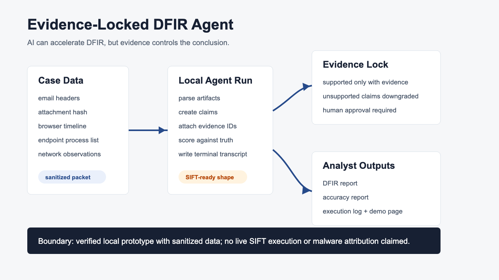
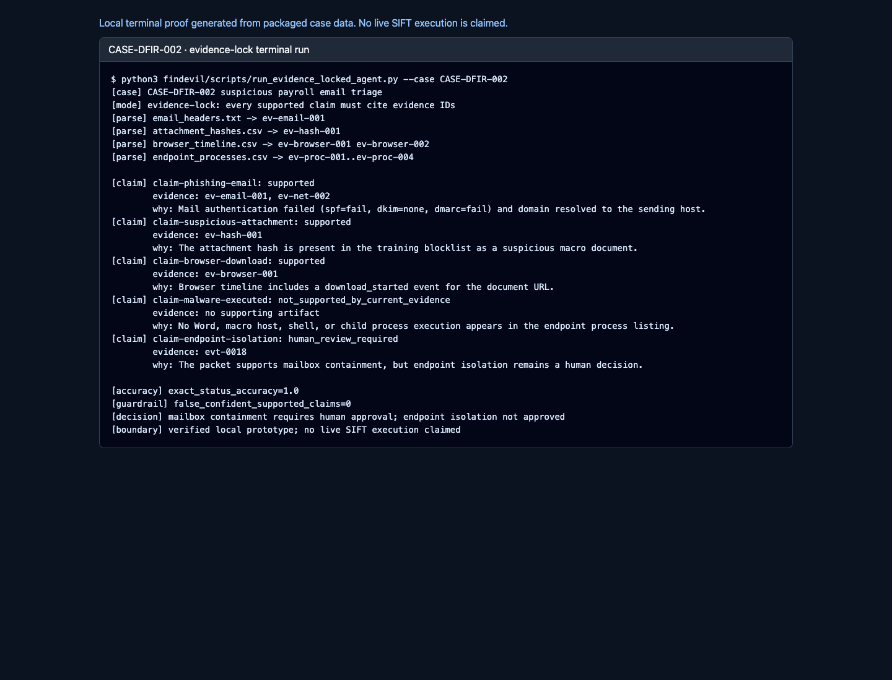

# Evidence-Locked DFIR Agent

AI-assisted incident response where every claim must cite evidence and unsupported certainty is treated as a risk.

Live demo: https://daideguchi.github.io/evidence-locked-dfir-agent/

YouTube demo: https://www.youtube.com/watch?v=Z0kuG3GabyY

Submission package: [SUBMISSION_PACKAGE.md](SUBMISSION_PACKAGE.md)

Architecture: [ARCHITECTURE.md](ARCHITECTURE.md)

License: [MIT](LICENSE)

Devpost field copy: [findevil/submission/devpost-submit-manual.md](findevil/submission/devpost-submit-manual.md)

## Judge Quick Read

**Who is this for?** Security analysts and incident responders.

**What problem does it solve?** AI can summarize a security incident quickly, but a fast confident summary is dangerous if it is not tied to artifacts.

**How does it solve it?** The agent parses a packaged suspicious-email case, creates claims, attaches evidence IDs, blocks unsupported malware-execution certainty, writes a report, scores itself against ground truth, and leaves containment behind a human approval gate.

**What is verified?** A local terminal run, evidence packet, analyst report, accuracy report, execution log, GitHub Pages demo, and narrated demo video.

## Demo






Demo video:

```text
https://www.youtube.com/watch?v=Z0kuG3GabyY
findevil/media/evidence-locked-dfir-agent-demo.mp4
```

Open in browser:

- https://daideguchi.github.io/evidence-locked-dfir-agent/
- https://daideguchi.github.io/evidence-locked-dfir-agent/findevil/prototype/evidence-locked-dfir-report.html
- https://daideguchi.github.io/evidence-locked-dfir-agent/findevil/prototype/terminal-session.html

## Run Locally

```bash
cd /path/to/evidence-locked-dfir-agent
bash findevil/scripts/run_findevil_local_checks.sh
```

Expected proof:

```text
findevil_local_checks_ok
claims_total=5
exact_status_accuracy=1.0
unsupported_claims_blocked=1
false_confident_supported_claims=0
claim_boundary=verified_local_sift_ready_no_live_sift_execution_claim
```

Run only the terminal agent:

```bash
python3 findevil/scripts/run_evidence_locked_agent.py
```

## What It Shows

- A terminal-executable DFIR workflow against inspectable case files.
- Evidence references for every supported claim.
- A malware-execution hypothesis being downgraded because current evidence does not prove it.
- Redaction and human approval gates that stay visible.
- An accuracy report comparing the agent output with packaged ground truth.
- A submission boundary that avoids claiming live SIFT execution before it is verified.

## Key Files

- `findevil/case_data/` - sanitized suspicious-email case packet.
- `findevil/scripts/run_evidence_locked_agent.py` - terminal workflow.
- `findevil/reports/agent-claims.json` - claim/status/evidence output.
- `findevil/reports/accuracy-report.md` - score against ground truth.
- `findevil/reports/evidence-lock-execution-log.jsonl` - replayable execution log.
- `findevil/prototype/evidence-locked-dfir-report.html` - analyst report.
- `findevil/prototype/terminal-session.html` - terminal transcript page.
- `findevil/media/evidence-locked-terminal-session-full.png` - terminal proof screenshot.
- `findevil/media/architecture-diagram.png` - PNG architecture diagram for Devpost upload/review.
- `ARCHITECTURE.md` - component and data-flow explanation.

## Submission Fit

- Architecture pattern: Alternative Agentic IDE / deterministic local agent workflow with evidence-lock guardrails.
- Primary coding agent workflow: Claude Code-style local coding agent development.
- SIFT boundary: SANS SIFT-ready artifact shape is modeled, but live SANS SIFT execution is not claimed.
- License: MIT.

## Hackathon Boundary

Safe claim:

- A local evidence-locked DFIR agent runs against packaged case data and produces evidence-bound claims, an analyst report, accuracy report, execution log, and natural English demo video.

Not claimed yet:

- Live SANS SIFT execution.
- Real malware attribution.
- Automated endpoint isolation.

The product is designed so those integrations can be added without changing the core rule: evidence controls the conclusion.
